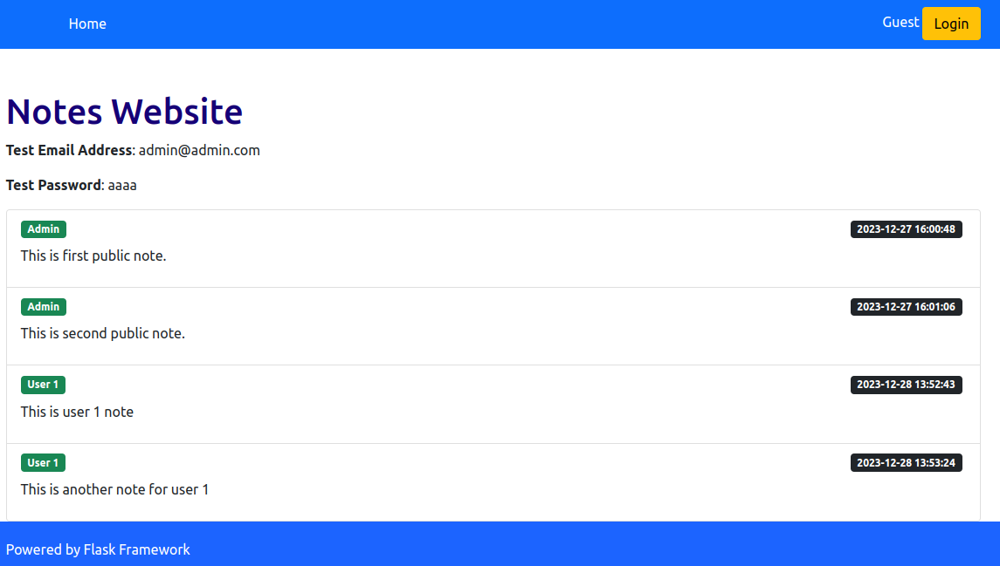
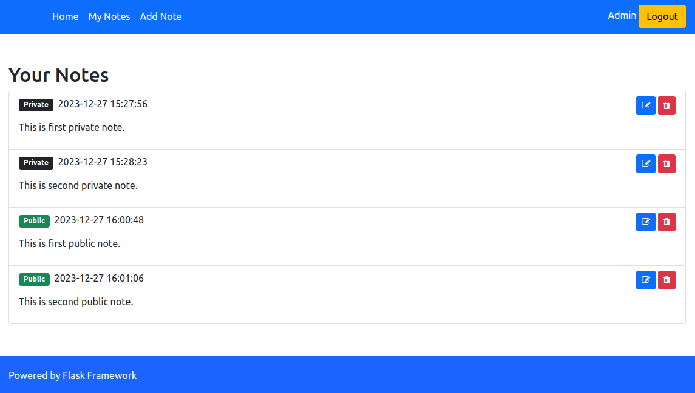

# Flask Notes Web App

Welcome to the Flask Notes Web App repository! This app is a simple yet powerful note-taking platform built with Flask, a lightweight web framework in Python. Users can create an account, sign in, and start creating personal notes. The homepage displays all public notes, allowing users to share information and collaborate.

## Features

- User authentication (sign up, sign in, sign out)
- Create, read, update, and delete personal notes
- Option to make notes public
- Viewable list of all public notes on the homepage

## Getting Started

Before you begin, ensure you have the following installed:

- Python 3.10+
- pip (Python package installer)

### Installation

1. Clone the repository to your local machine and change directory to the root of the project.

4. Install the required dependencies:
    ```sh
    pip install -r requirements.txt
    ```

5. Run the Flask application:
    ```sh
    python src/main.py
    ```

6. Open your web browser and go to `http://127.0.0.1:5000/` to see the app in action.

## Usage

To use the app, navigate to the homepage and sign up for an account. After signing in, you'll be able to create new notes, edit existing ones, delete them, or make them public. All public notes will automatically appear on the homepage for other users to see.

# Screenshot


